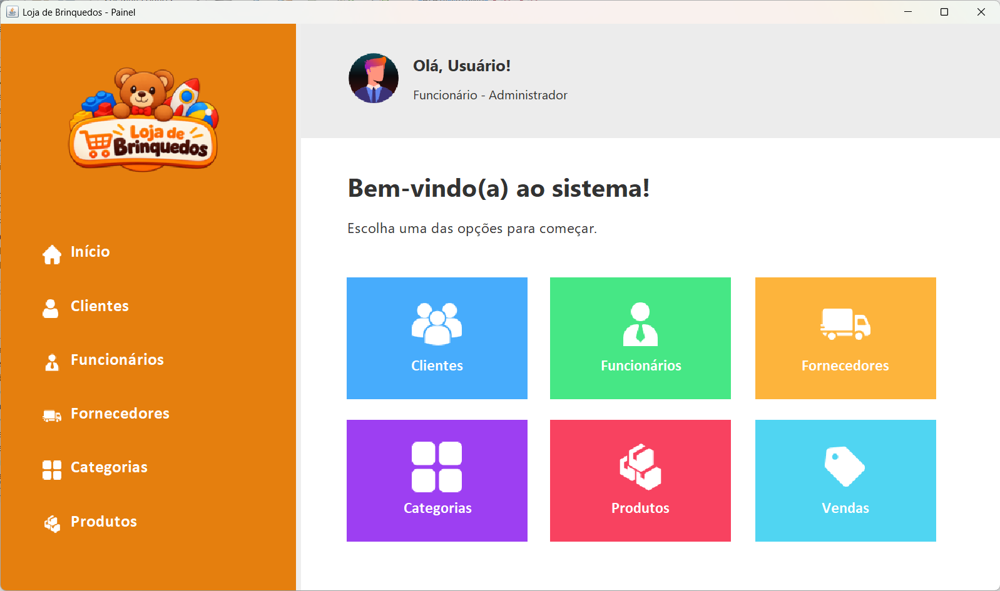
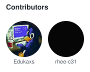

<h1 align="center">Toy Shop</h1>

<p align="center">
  
</p>

<p align="center">
  Toy shop management system developed as a school project using Java.
</p>
## About the Project

**Toy Shop** is a system designed to help manage a toy store by organizing information about customers, employees, suppliers, categories, products, and sales.

The project also aims to put into practice concepts related to **web development, relational databases, and SQL**.

## Technologies Used

* **Java** — system development
* **SQL Server** — database
* **Apache NetBeans** — IDE

## Database

The database consists of the following tables:

* `funcionario`
* `cliente`
* `fornecedor`
* `categoria`
* `produto`
* `venda`
* `item_venda`

### Main Relationships

* A **supplier** can provide multiple products.
* A **category** can contain multiple products.
* A **customer** can make multiple sales.
* An **employee** can register multiple sales.
* A **sale** can contain multiple items.
* A **product** can appear in multiple sale items.

## Project Structure

```text
Toy-Shop/
├── database/
│   └── DDL.sql
├── system/
│   ├── css/
│   ├── js/
│   ├── img/
│   └── ...
├── README.md
└── ...
```

> The folder structure may be modified as the project develops.

## Academic Objectives

This project was developed to apply practical knowledge of:

* Database modeling
* DDL and SQL
* Primary and foreign keys
* Relationships between tables
* Database integration

## Team Members


## Status

**In Development**

---

Academic Project — **Toy Shop**
